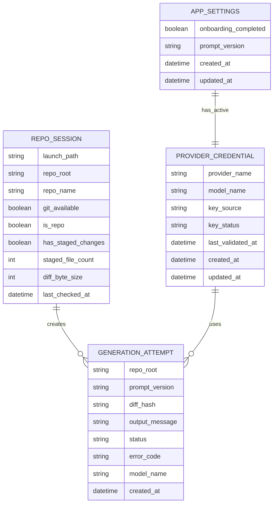

# GitRoast MVP Logical ERD

## Purpose

This ERD describes the logical data model for the GitRoast MVP. It is not a commitment to a relational database. Some entities are persisted and some are runtime-only. The secret itself is not persisted by the app in MVP; it is read from env at runtime.

The model is intentionally limited to the MVP:
- one provider: `gemini`
- default model: `gemini-2.5-flash`
- one launch flow: `gitroast` from the current working directory, with optional in-app repo switching

## Mermaid ERD

## Entity Definitions

### `AppSettings`

Represents non-secret application settings that define whether onboarding is complete, which prompt version the app should use, and which Gemini model the user selected.

Fields:
- `onboarding_completed`: whether the user has successfully completed env-based setup at least once
- `model_name`: selected Gemini model stored in app config, defaulting to `gemini-2.5-flash`
- `prompt_version`: version label for the fixed internal commit-generation prompt
- `created_at`
- `updated_at`

### `ProviderCredential`

Represents the active provider configuration for the MVP. In v1 this record is fixed to Gemini and stores metadata about the credential, not the raw secret value.

Fields:
- `provider_name`: fixed as `gemini`
- `model_name`: resolved from app config or defaults to `gemini-2.5-flash`
- `key_source`: source label such as `.env.local`, `.env`, or shell env
- `key_status`: lifecycle state such as `missing`, `saved`, `valid`, or `invalid`
- `last_validated_at`
- `created_at`
- `updated_at`

### `RepoSession`

Represents the active runtime context derived from the CLI launch directory and current Git checks. It is a session-scoped view of the repo, not long-term user content.

Fields:
- `launch_path`: working directory passed into the app at launch
- `repo_root`: canonical Git root returned by `git rev-parse --show-toplevel`
- `repo_name`: last path segment of `repo_root`
- `git_available`: whether Git can be executed
- `is_repo`: whether the launch path belongs to a Git repository
- `has_staged_changes`: whether `git diff --staged` is non-empty
- `staged_file_count`: count from `git diff --staged --name-only`
- `diff_byte_size`: byte length of the staged diff payload
- `last_checked_at`

### `GenerationAttempt`

Represents one request to create a commit message from a staged diff. It can be stored temporarily for diagnostics or remain in-memory only, but it exists logically because the app has a distinct generation action and result state.

Fields:
- `repo_root`: the repository associated with the generation
- `prompt_version`: prompt revision used for this request
- `diff_hash`: stable hash of the diff content for request tracking without storing the full diff
- `output_message`: generated commit message when successful
- `status`: such as `success`, `provider_error`, `invalid_key`, `timeout`, or `diff_too_large`
- `error_code`: normalized error identifier for UI mapping
- `model_name`: one of the supported Gemini model names
- `created_at`

## Relationship Defaults

- `AppSettings` has exactly one active `ProviderCredential`
- one `RepoSession` can have many `GenerationAttempt`
- each `GenerationAttempt` uses one `ProviderCredential`

These relationships support the MVP without implying multi-account or multi-provider support.

## Storage Boundaries

### Secret Handling

The raw Gemini API key is not persisted by the app in MVP. It is read at runtime from:
- `.env.local`
- `.env`
- inherited shell env

The app stores only source labels, validation metadata, and model preference in normal app-managed state.

### Local App Config

Non-secret records can live in local app config or app-managed storage:
- `AppSettings`
- non-secret fields from `ProviderCredential`

This storage is appropriate for lightweight persisted preferences and status metadata.

### Runtime State

`RepoSession` is runtime-only in MVP. It is derived at launch and refreshed on demand. It does not need durable persistence.

### Ephemeral Generation Records

`GenerationAttempt` may be:
- in-memory only
- written to transient local state for debugging
- omitted from durable storage in MVP

It is still modeled here because the app has explicit generation requests, outcomes, and error mappings.

## State and Error Mapping Notes

The ERD supports these user-visible conditions:
- missing API key
- invalid launch context
- no staged changes
- ready to generate
- generating
- generation success
- generation error

Recommended `error_code` values for `GenerationAttempt`:
- `missing_api_key`
- `invalid_api_key`
- `git_unavailable`
- `not_a_repo`
- `no_staged_changes`
- `diff_too_large`
- `provider_timeout`
- `provider_error`

## Design Constraints

- Do not expand this model for persona packs, billing, or cloud sync in MVP docs.
- Do not treat the ERD as evidence that a full database is required.
- Do not persist full diffs by default; use `diff_hash` for lightweight correlation.
